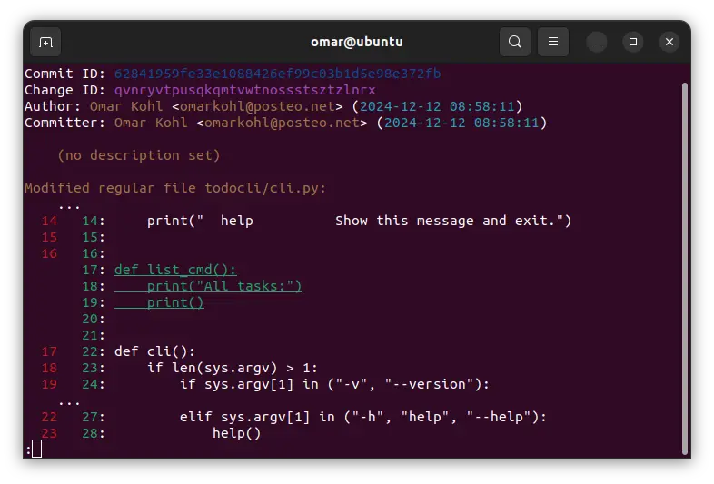
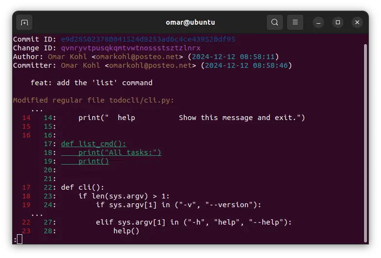
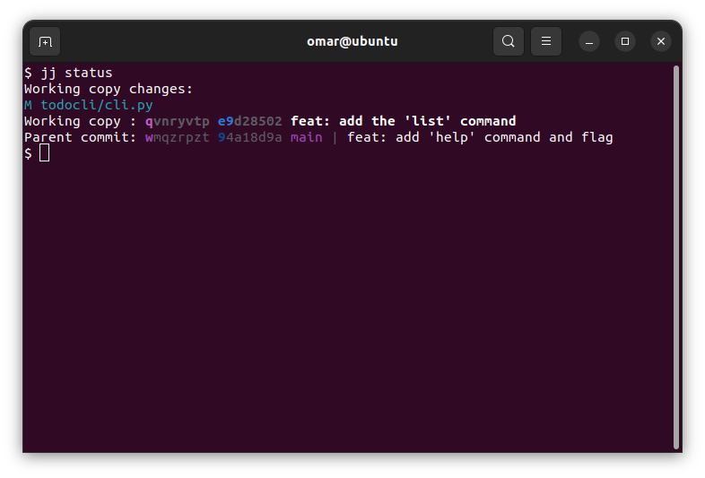
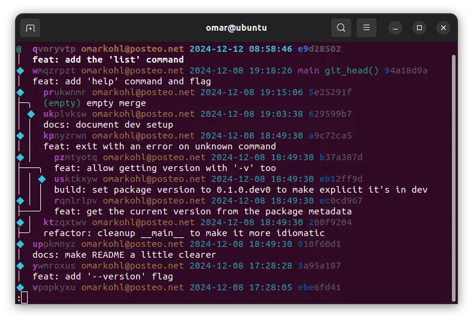
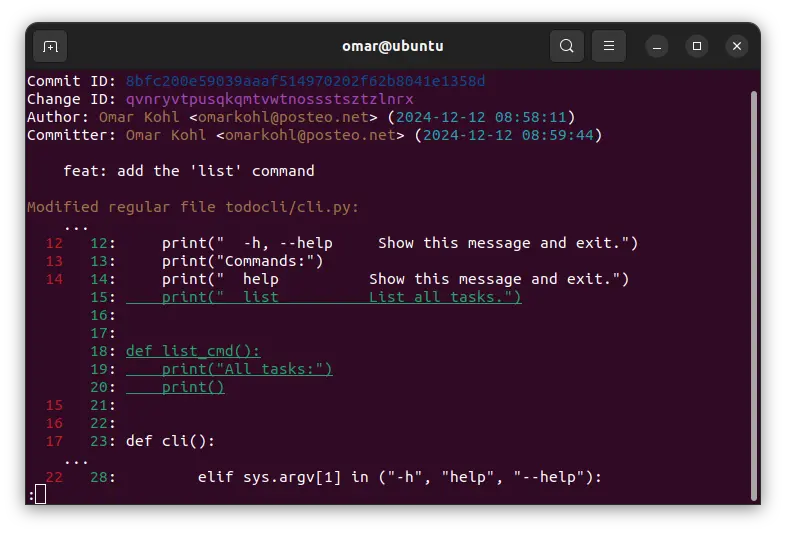

# Adding Changes

This section will present a workflow for how to develop new features for the
`todocli` project. You may not like the workflow and even if you continue using
`jj` you may want to (and can!) deviate from it. The goal is to give you a
starting point. Give it a try!


## Preparation

Make sure you have set up everything as described in the [Setup](./setup.md).


## What will we do

* Implement listing all tasks
* Implement storing tasks in a file
* Document the changes

We will be using the following `jj` commands:

* `describe`
* `diff`
* `new`
* `rebase`
* `split`
* `squash`
* `status`


## Listing tasks

Start with an empty change on top of `main`:

```bash
jj new main
```

Replace `todocli/cli.py` with the following to simulate you developing this new
feature.

```python title="todocli/cli.py"
import sys
from .__version__ import __version__

def version():
    print(f"todocli {__version__}")


def help():
    print("Usage: todocli [OPTIONS] COMMAND [ARGS]...")
    print("Options:")
    print("  -v, --version  Show the version and exit.")
    print("  -h, --help     Show this message and exit.")
    print("Commands:")
    print("  help          Show this message and exit.")


def list_cmd():
    print("All tasks:")
    print()


def cli():
    if len(sys.argv) > 1:
        if sys.argv[1] in ("-v", "--version"):
            version()
            return
        elif sys.argv[1] in ("-h", "help", "--help"):
            help()
            return
        elif sys.argv[1] == "list":
            list_cmd()
        else:
            print("Unknown command")
            sys.exit(1)
    print("Hello, World!")
```

Let's look at what we got:

```bash
jj show
```



Let's describe what we did:

```bash
jj describe -m "feat: add the 'list' command"
```

Look at the result:

```bash
jj show
```



```bash
jj status
```



```bash
jj
```



Now we notice that we forgot to update the help text of `todocli` so let's fix that:

```python title="todocli/cli.py"
def help():
    print("Usage: todocli [OPTIONS] COMMAND [ARGS]...")
    print("Options:")
    print("  -v, --version  Show the version and exit.")
    print("  -h, --help     Show this message and exit.")
    print("Commands:")
    print("  help          Show this message and exit.")
    print("  list          List all tasks.")
```

Let's look at the result:

```bash
jj show
```



We are still working on the same change, with the same description as before.
It was _automagically_ updated simply by us changing the code.

OK, let's move on to the next feature.

```bash
jj new
```

Well, on second though, we should document the `list` command so let's do that.
Insert the following above the `## Dev Setup` section in the `README.md`:

```md title="README.md"
## Usage

Call `todocli --help` for usage documentation.

The most important commands:

* help: Usage documentation
* list: List all tasks
```

We want to split this new change into two, one for the new "Usage" section in
the README and then another for documenting just the "list" command, to include
in the change that also introduced that command. This way the relevant
documentation is together with the code.

```bash
jj split -i README.md
```

This will open a TUI (terminal UI). The menu bar at the top is clickable, but
there are also keyboard shortcuts for everything.

The purpose of `split` is to split a change into two. Whatever we select
initially will go into the first change, the rest will go into the second
change.

Let's press the arrow-right key to open the detailed diff for README.md and
then select all lines (with space key) except the one with `list: List all
tasks`.

Then confirm with the `c` key.

An editor will open for us to describe the change we are creating. Let's enter something like:

```text
docs: add usage documentation
```

Look at the result:

```bash
jj show
```

```bash
jj diff
```

```bash
jj
```

Now let's describe the change for the usage documentation of "list":

```bash
jj describe -m "docs: document 'list' command"
```

Create a new (empty) change since you are done working on the previous change:

```bash
jj new
```

Now let's re-order the changes.

Check the output of the log and remember the change ID of the `docs: add usage documentation` change.

```bash
jj rebase -r CHANGE_ID -A main
```

This will move that change _after_ `main`, inserting itself into the chain of
changes. Check the result to see what I mean:

```bash
jj
```

Next we want to squash the change `docs: document 'list' command` into the
change where we implemented that feature since we think that documentation and
code should be together, also in the version control history.

Check the `log` and identify the change ID of the `docs: document 'list'
command` change. Then execute:

```bash
jj squash -r CHANGE_ID
```

By default `squash` will squash a change into that change's parent, which in
this case is what we wanted. If that is not desired you can specify a different
target change with `--into`.

Look at the final result:

```bash
jj
```
