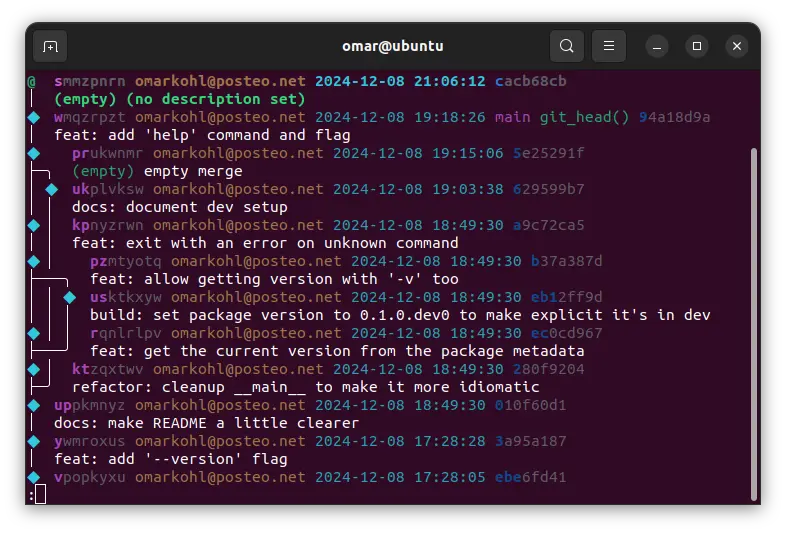

import Tabs from '@theme/Tabs';
import TabItem from '@theme/TabItem';

# Log

## Introduction

:::tip Change vs. Commit

`jj` distinguishes between change and commit. A change is a commit as it
evolves over time. You can consider both to be equivalent only that the change
ID will remain the same as you modify that change (as opposed to the commit ID,
which is different after every amend, rebase etc.). This is very convenient if
you keep modifying the same change. Commits are exactly the same thing as in
Git, in fact `jj` relies on having an underlying Git repository.

Another way of looking at it would be to say that the change ID is a label that
`jj` attaches to a commit. Whenever you operate on that commit, `jj` will
notice this and after modifying the commit will move the label from the old
obsolete commit to the new one. Remember that commits in Git are immutable and
any modification to the parents, commit message, commit date, content etc. will
cause a new commit to be created that will have a different commit ID (hash),
even if the commit may _look_ unchanged at first glance.

:::

The `jj log` command shows the history of the repository. If you configured `jj`
as recommended in the last section, you can simply run `jj` to get the log
output.

```bash
jj
```



A few things to note about the above screenshot:

* Starting at the top left, `@` is the working copy, which includes all
  "uncommitted" modifications to the working directory. "uncommitted" is in
  quotes because in jj, changes are always committed. It is only uncommitted in
  the usual Git sense.
* Next to it, you have `smmzpnrn`, the change ID. Every change has such an ID
  that never changes even as you modify, rebase etc. the change. Highlighted is
  the shortest unique prefix that identifies the change, `s` in this case.
  Whenever a change ID is required you can just use this prefix.
* After the email address and commit date you have the commit ID as in Git. It
  is in fact exactly the same commit ID as in Git. It will change every time you
  modify the change. In this case `cacb68cb`, again with the shortest unique
  prefix `c` highlighted.
* The next change `w` has a bookmark `main` attached to it. Bookmarks are
  the jj equivalent of branches. Also attached to it is the `git_head()` revset
  function which identifies the HEAD of the Git repository. You'll notice that
  the `@` change is not included in `git_head()`, meaning it will not appear
  when for instance you execute `git log`. Ju Jutsu maintains a separate
  internal Git history inside the `.jj` directory.


## Examples

Try them!

```bash title="Show all the history"
jj -r ::
```

```bash title="Show the ancestors of 'main' but limit to 3"
jj -r ..main -n 3
```

```bash title="Show all children of the change 'kt'"
jj -r kt+
```

```bash title="Show all changes that are ancestors of 'main' and were commited on 2024-12-05"
jj -r 'committer_date(after:"2024-12-05") & committer_date(before:"2024-12-06") & ::main'
```

Check the [Revset language](https://martinvonz.github.io/jj/latest/revsets/) for
more options.


## Other Commands

Try them out!

Some more useful commands and options:

```bash title="Display log with file names"
jj -s
```

```bash title="Summarize the current change"
jj show
```

```bash title="Summarize the latest change on 'main', only file names"
jj show -s main
```


## Takeaways

Key points. As QA because of [active
recall](https://en.wikipedia.org/wiki/Testing_effect). Try to come up with the
answer yourself before looking 😉

<Tabs>
  <TabItem value="questions" label="Questions" default>
    1. What is a change?
    2. What is `@`?
  </TabItem>
  <TabItem value="answers" label="Answers">
    1. A commit as it evolves over time. Even if you amend, rebase or change
       the description, the change ID will remain the same whereas the commit
       ID (hash) will not.
    2. A short expression to refer to the working copy change i.e. the change
       that matches all the files in your repository as you are seeing them
       _right now_. It is quite common to refer to the parent or grandparent of
       this change with `@-` and `@--` respectively.
  </TabItem>
</Tabs>
